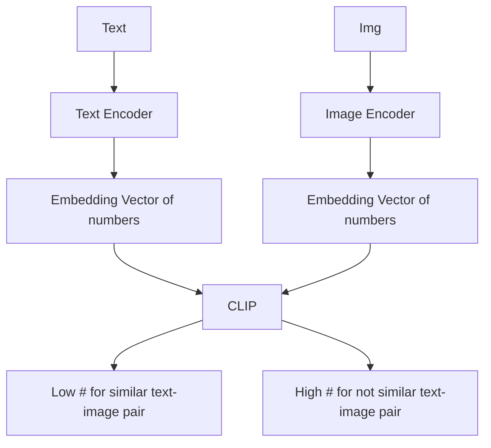

# Multimodal Models
## Clip : Connecting Text & Images

[Colab link](https://drive.google.com/open?id=1e3sR-x7I5DREF97AXMeBUDGbKNn9WfJO&authuser=mrahusain%40gmail.com&usp=drive_fs)
[HuggingFace API](https://huggingface.co/openai/clip-vit-base-patch32)
[GitHub - openai/CLIP: Contrastive Language-Image Pretraining](https://github.com/openai/CLIP)
![[Pasted image 20220825121135.png]]

- Creates this joint embedding. Trained on several image & caption pairs from the internet.
- CLIP can be applied to any visual classification benchmark by simply providing the names of the visual categories to be recognized, similar to the “zero-shot” capabilities of GPT-2 and GPT-3.
- An ImageNet model is good at predicting the 1000 ImageNet categories, but that’s all it can do “out of the box.” If we wish to perform any other task, an [[machine-learning|ML]] practitioner needs to build a new dataset, add an output head, and fine-tune the model. In contrast, CLIP can be adapted to perform a wide variety of visual classification tasks without needing additional training examples. To apply CLIP to a new task, all we need to do is “tell” CLIP’s text-encoder the names of the task’s visual concepts, and it will output a linear classifier of CLIP’s visual representations. The accuracy of this classifier is often competitive with fully supervised models.
- two algorithmic choices that led to significant compute savings: 1. contrastive objective for connecting text with images & 2. using Vision [[transformer]] over standard ResNet

My understanding of the architecture

Uses ResNet-50 as image encoder.

## Glip - Grounded Language Image Pretraining

[2112.03857.pdf](https://arxiv.org/pdf/2112.03857.pdf)
![[shiny new models-2023-08-24-1.png]]
In this paper, we show that phrase grounding, which is a task of identifying the fine-grained correspondence between phrases in a sentence and objects (or regions) in an image, is an effective and scalable pre-training task to learn an objectlevel, language-aware, and semantic-rich visual representation, and propose Grounded Language-Image Pre-training (GLIP). Our approach unifies the phrase grounding and object detection tasks in that object detection can be cast as context-free phrase grounding while phrase grounding can be viewed as a contextualized object detection task.
*Kind of like CLIP but with object detection & localization*

 GLIP’s performance can be constrained since it is designed based on a traditional one-stage detector Dynamic Head - from [[#Grounding DINO Marrying DINO with Grounded Pre-Training for Open-Set Object Detection]] paper.

## Clipdraw

[CLIPDraw: Exploring Text-to-Drawing Synthesis](https://kvfrans.com/clipdraw-exploring-text-to-drawing-synthesis/)
		- For more detailed analysis and technical detail, check out the [CLIPDraw paper](https://arxiv.org/abs/2106.14843), or play around with [the Colab notebook](https://colab.research.google.com/github/ kvfrans/clipdraw/blob/main/clipdraw.ipynb) yourself!
		- With CLIPDraw, I took inspiration from the web game [Skribbl.io](https://skribbl.io/), where players only have a few seconds to draw out a word for other players to guess.
		- CLIP model consists of an image encoder and a text encoder, which both map onto the same represenational space. This setup allows us to measure the similarities betweeen images and text. And if we can measure similarities, we can also try to discover images that maximize that similarity, therefore matching a given textual prompt.
		- First, start with a human-given description prompt and a random set of Bezier curves. Then, gradually adjust those curves through gradient descent so that the drawing best matches the given prompt.
		![[Pasted image 20221001131310.png]]

![[download.mp4]]

![[download (1).mp4]]

## Gato - 1.2B Parameters

([Gato](https://www.deepmind.com/publications/a-generalist-agent)): A generalist agent from Deepmind - works as a multi-modal, multi-task, multi-embodiment generalist policy. The same network with the same weights can play Atari, caption images, chat, stack blocks with a real robot arm and much more, deciding based on its context whether to output text, joint torques, button presses, or other tokens.
	 - 1.2 billion parameters - rather small because of the need for faster inference if it needs to run on robot.
	 - Gato architecture uses a single [[transformer]] decoder to process inputs and generate outputs much like standard large language models. Inputs from various modalities are tokenized, embedded, and given positional encodings. For instance, images are converted into 16x16 patches as in ViT, text is tokenized by a subword tokenizer, and discrete values like Atari button-presses are treated as sequences of integers. Discrete tokens are given learnable embeddings from a look-up table, and image tokens are embedded with a ResNet.
	 - Given an input sequence, Gato outputs next token predictions. As Gato takes various types of tokens from different modalities as input, Gato can also output tokens of different modalities: it can predict the next text tokens that follow a sequence of text, or it can output tokens representing actions that an agent can make in a control task.
		  ![[ai-ml/attachments/Untitled 1.png]]

## Flamingo

[Flamingo Demo](https://dm-vlm-applied.corp.google.com/) , [Blog](https://www.deepmind.com/blog/tackling-multiple-tasks-with-a-single-visual-language-model), 80B parameter #sandbox
Single visual language model (VLM) that sets a new state of the art in few-shot learning on a wide range of open-ended multimodal tasks.
[[Fig_03b.mp4 |Demo video]]
[[Flamingo- a Visual Language Model for Few Shot Learning.pdf |Paper]]
![[image.png]]
we start from [Chinchilla](https://www.deepmind.com/publications/an-empirical-analysis-of-compute-optimal-large-language-model-training), our recently introduced compute-optimal 70B parameter language model, to train our final Flamingo model, an 80B parameter VLM.

## Openflamingo

[GitHub - mlfoundations/open\_flamingo: An open-source framework for training large multimodal models.](https://github.com/mlfoundations/open_flamingo)
OpenFlamingo is a multimodal language model that can be used for a variety of tasks. It is trained on a large multimodal dataset (e.g. Multimodal C4) and can be used to generate text conditioned on interleaved images/text. For example, OpenFlamingo can be used to generate a caption for an image, or to generate a question given an image and a text passage.

## Vector-quantized Image Modeling with Improved Vqgan
- [blog](https://ai.googleblog.com/2022/05/vector-quantized-image-modeling-with.html)
- An alternative to [[diffusion model]]. Used as the image tokenizer to build [[*shiny-fm-datasets#Parti]]
- Several recent papers have exploited this formulation to dramatically improve image generation results through [pre-quantizing images](https://arxiv.org/abs/1711.00937) into discrete integer codes (represented as natural numbers), and [modeling them](https://arxiv.org/abs/2102.12092) [autoregressively](https://arxiv.org/abs/2012.09841) (i.e., predicting sequences one token at a time). In these approaches, a [convolutional neural network](https://en.wikipedia.org/wiki/Convolutional_neural_network) ([[convolutional neural nets|CNN]]) is trained to encode an image into discrete tokens, each corresponding to a small patch of the image. A second stage [[convolutional neural nets|CNN]] or [Transformer](https://ai.googleblog.com/2017/08/transformer-novel-neural-network.html) is then trained to model the distribution of encoded latent variables. The second stage can also be applied to autoregressively generate an image after the training.
![[Pasted image 20220902112742.png]]
 - Vector-quantized Image Modeling (VIM), which pretrains a [[transformer]] to predict image tokens autoregressively, where discrete image tokens are produced from improved ViT-VQGAN image quantizers.
 - The image encoding and decing is done with ViT. The autoregressive [[transformer]] is  [VQGAN](https://arxiv.org/abs/2012.09841).

## Grounding DINO: Marrying DINO with Grounded Pre-Training for Open-Set Object Detection

 The key solution of openset object detection is introducing language to a closed-set detector for open-set concept generalization. To effectively fuse language and vision modalities, we conceptually divide a closed-set detector into three phases and propose a tight fusion solution, which includes a feature enhancer, a language-guided query selection, and a cross-modality decoder for cross-modality fusion.
![[shiny new models-2023-08-24-2.png|550]]
This figure below provides a good overview between closed set and open set object detection:
![[shiny new models-2023-08-24-3.png|550]]

Motivated by the encouraging progress of Transformerbased detectors, in this work, we propose to build a strong open-set detector based on DINO, which not only offers the state-of-the-art object detection performance, but also allows us to integrate multi-level text information into its algorithm by grounded pre-training.

Grounding DINO has several advantages over GLIP. First, its Transformer based architecture is similar to language models, making it easier to process both image and language data. For example, as all the image and language branches are built with Transformers, we can easily fuse cross-modality features in its whole pipeline. Second, Transformer-based detectors have demonstrated a superior capability of leveraging large-scale datasets. Lastly, as a DETR-like model (end to DEtection TRansformer), DINO can be optimized end-to-end without using any hard-crafted modules such as NMS (Non-Maximum Suppression), which greatly simplifies the overall grounding model design.

 Unlike classical detectors, the Transformerbased detector DINO has a consistent structure with language blocks. The layer-by-layer design enables it to interact with language information easily. Under this principle, we design three feature fusion approaches in the neck, query initialization, and head phases.

![[shiny new models-2023-08-24-4.png|600]]

- Grounding DINO outputs multiple pairs of object boxes and noun phrases for a given (Image, Text) pair
- Grounding DINO is a dual-encoder-single-decoder architecture.

## DETR - End-to-End Object Detection with Transformers

[2005.12872.pdf](https://arxiv.org/pdf/2005.12872.pdf) - Paper from May 2020

 Our approach streamlines the detection pipeline, effectively removing the need for many hand-designed components like a non-maximum suppression procedure or anchor generation that explicitly encode our prior knowledge about the task. The main ingredients of the new framework, called DEtection TRansformer or DETR, are a set-based global loss that forces unique predictions via bipartite matching, and a transformer encoder-decoder architecture.
  Modern detectors address this set prediction task in an indirect way, by defining surrogate regression and classification problems on a large set of proposals [37,5], anchors [23], or window centers [53,46]. Their performances are significantly influenced by postprocessing steps to collapse near-duplicate predictions, by the design of the anchor sets and by the heuristics that assign target boxes to anchors [52]. To simplify these pipelines, we propose a direct set prediction approach to bypass the surrogate tasks. This end-to-end philosophy has led to significant advances in complex structured prediction tasks such as machine translation or speech recognition, but not yet in object detection
![[shiny new models-2023-08-28.png|500]]

DETR infers a fixed-size set of N predictions, in a single pass through the decoder, where N is set to be significantly larger than the typical number of objects in an image. One of the main difficulties of training is to score predicted objects (class, position, size) with respect to the ground truth. Our loss produces an optimal bipartite matching between predicted and ground truth objects, and then optimize object-specific (bounding box) losses.

## X-Decoder

Predecessor to [[#Segment Everything Everywhere All at Once (SEEM)]]
![[shiny new models-2023-08-25.png|575]]
![[shiny new models-2023-08-25-1.png|650]]
Very generic decoder architecture for getting various image outputs

## Segment Everything Everywhere All at Once (SEEM)

#sandbox [SEEM Demo](https://huggingface.co/spaces/xdecoder/SEEM)
[GitHub - UX-Decoder/Segment-Everything-Everywhere-All-At-Once: Official implementation of the paper "Segment Everything Everywhere All at Once"](https://github.com/UX-Decoder/Segment-Everything-Everywhere-All-At-Once)
Like [[*shiny-fm-datasets#Segment Anything (SAM)|SAM]], SEEM's architecture incorporates a universal encoder that encodes image-text representations in a shared space, as well as a lightweight decoder that produces masks and class embeddings. This design offers advantages in interactive scenarios, where features can be pre-computed and the decoder can be queried multiple times. Furthermore, visual and text prompts are aligned with mask and class embeddings to improve performance, and at test time, visual/text prompts can be concatenated and fed into the network, even if they were not trained in this way.
Can effectively handle all types of generic segmentation tasks, including panoptic/instance/semantic.
Apparently better than SAM
![[shiny new models-2023-08-24-6.png|675]]

- We design a new prompting scheme that can encode various user intents into prompts in a joint visual-semantic space, enabling strong flexibility for various segmentation tasks and generalization capability to unseen prompts or their combinations.
- We build SEEM, a universal and interactive segmentation interface that integrates the newly designed prompting mechanism into a lightweight decoder for all segmentation tasks, leading to a model possessing properties of versatility, compositionality, interactivity, and semantic awareness.
SEEM works very well on text to mask (grounding segmentation) and outputs semantic-aware predictions.
![[shiny new models-2023-08-24-7.png]]

Our model framework follows X-Decoder [11] except the decoder. That is, we have a vision backbone, a language backbone, an encoder, and SEEM-Decoder. For the vision backbone, we use FocalT [58], DaViT-d3 (B), and DaViT-d5 (L) [59]. For the language encoder, we adopt a UniCL or Florence text encoder.

## Recognize Anything: A Strong Image Tagging Model (RAM)

**Recognition and localization are two foundation computer vision tasks.**

- **[The Segment Anything Model (SAM)](https://segment-anything.com/)** excels in **localization capabilities**, while it falls short when it comes to **recognition tasks**.
- **The Recognize Anything Model (RAM)** exhibits **exceptional recognition abilities**, in terms of both **accuracy and scope.**
![[shiny new models-2023-08-25-2.png]]
![[shiny new models-2023-08-25-3.png]]
Only does image tagging and no object localization. Needs to get combined with GroundingDINO for localization. Which is pretty much what GroundedSAM does but also gives masks.

## LLaVA

[LLaVA](https://llava-vl.github.io/), [Code](https://github.com/haotian-liu/LLaVA), [HuggingFace model](https://huggingface.co/liuhaotian/LLaVA-13b-delta-v0) - [[visual language models]]

LLaVA represents a novel end-to-end trained large multimodal model that combines a vision encoder and Vicuna for general-purpose visual and language understanding, achieving impressive chat capabilities mimicking spirits of the multimodal GPT-4 and setting a new state-of-the-art accuracy on Science QA.
Does visual question answering like [[#Flamingo]]
First attempt to use [language-only GPT-4](https://openai.com/research/gpt-4) to generate multimodal language-image instruction-following data.
**LLaVA-Instruct-150K** - Based on the COCO dataset, we interact with langauge-only GPT-4, and collect 158K unique language-image instruction-following samples in total, including 58K in conversations, 23K in detailed description, and 77k in complex reasoning, respectively.
LLaVa connects pre-trained [CLIP ViT-L/14](https://openai.com/research/clip) visual encoder and large language model [Vicuna](https://github.com/lm-sys/FastChat), using a simple projection matrix.
It uses GPT-4 as the judge for a lot of their evaluation metrics.

More sophisticated (but expensive) schemes to connect the image and language representations can also be considered, such as gated cross-attention in Flamingo and Q-former in BLIP-2 , or other vision encoders such as SAM that provide object-level features. We leave exploring possibly more effective and sophisticated architecture designs for LLaVA as future work.

## Otter

![[shiny new models-2023-07-25-5.png]]
Otter is designed to support multi-modal in-context instruction tuning based on the OpenFlamingo model, which involves conditioning the language model on the corresponding media, such as an image that corresponds to a caption or an instruction-response pair.
*They create their own multi modal instruction tuning dataset - [[#[MIMIC-IT](https //github.com/Luodian/Otter/blob/main/mimic-it/README.md)|MIMIC-IT]]*
*From my understanding the difference between multimodal models like Otter / Flamingo & LLava etc are the way in which vision encoders are fused with language. Llava does a simple projection on top of CLIP embeddings while Otter / Flamingo use gated cross attention layers. Otter is just an instruction tuned variant of Flamingo*

## BLIP-2

[BLIP-2: Scalable Multimodal Pre-training Method](https://blog.salesforceairesearch.com/blip-2/)
BLIP-2 is a scalable multimodal pre-training method that enables **any** LLMs to understand images while keeping their parameters entirely frozen. It is significantly more compute-efficient than existing multimodal pre-training methods. Why? BLIP-2 effectively Bootstraps Language-Image Pre-training with frozen image encoders and frozen LLMs. For example, to transform an existing 11B-LLM into a state-of-the-art multimodal foundation model, it only requires training of less than 2% parameters (only 188M trainable parameters).
Proposes a **Querying Transformer (Q-Former)** pre-trained with a new two-stage pre-training strategy. After pre-training, the Q-Former can effectively act as a bridge between a frozen image r and a frozen LLM, thus closing the modality gap.
![[shiny new models-2023-07-26.png]]

The second stage is vision-to-language **generative learning**. In this stage, we connect the output of Q-Former to a frozen LLM. We pre-train the Q-Former such that its output features can be interpreted by the LLM to generate the corresponding text. We experiment with both decoder-based LLMs (e.g. OPT) and encoder-decoder-based LLMs (e.g. FlanT5).
![[shiny new models-2023-07-26-1.png]]

## BLIP

[BLIP: Bootstrapping Language-Image Pre-training for Unified Vision-Language Understanding and Generation](https://blog.salesforceairesearch.com/blip-bootstrapping-language-image-pretraining/)
BLIP ***jointly optimizes three objectives during pre-training***, with two understanding-based objectives (ITC, ITM) and one generation-based objective (LM):

- **Image-Text Contrastive Loss (ITC)** activates the unimodal encoder. It aims to *align the feature space of the visual transformer and the text transformer by encouraging positive image-text pairs to have similar representations* in contrast to the negative pairs.
- **Image-Text Matching Loss (ITM)** activates the image-grounded text encoder. ITM is a binary classification task, where *the model is asked to predict whether an image-text pair is positive (matched) or negative (unmatched)* given their multimodal feature.
- **Language Modeling Loss (LM)** activates the image-grounded text decoder, which aims to *generate textual descriptions conditioned on the images*.

*I think its similar to [[#Clip Connecting Text & Images]]*

## MiniGPT-4

[GitHub - Vision-CAIR/MiniGPT-4: MiniGPT-4: Enhancing Vision-language Understanding with Advanced Large Language Models](https://github.com/Vision-CAIR/MiniGPT-4)

- MiniGPT-4 aligns a frozen visual encoder from BLIP-2 with a frozen LLM, Vicuna, using just one projection layer.
- We train MiniGPT-4 with two stages. The first traditional pretraining stage is trained using roughly 5 million aligned image-text pairs in 10 hours using 4 A100s. After the first stage, Vicuna is able to understand the image. But the generation ability of Vicuna is heavilly impacted.
- The second finetuning stage is trained on this dataset in a conversation template to significantly improve its generation reliability and overall usability. To our surprise, this stage is computationally efficient and takes only around 7 minutes with a single A100.
![[shiny new models-2023-07-26-4.png]]

## LAVIS

Not really a model but a deep learning library for VLMs - [GitHub - salesforce/LAVIS: LAVIS - A One-stop Library for Language-Vision Intelligence](https://github.com/salesforce/LAVIS)

## Semantic-SAM

The existing image segmentation model architectures are dominated by the single-input-single-output pipeline that discards any ambiguity. While this pipeline is prevalent in both anchor-based CNN architectures [24] and query-based Transformer architectures [4, 11], and has demonstrated remarkable performance in semantic, instance, and panoptic segmentation tasks [39, 68, 30], it inherently restricts the model to predict multi-granularity segmentation masks in an end-to-end manner.
Scaling up segmentation datasets that possess both semantic-awareness and granularity-awareness is a costly endeavor. Existing generic object and segmentation datasets such as MSCOCO [39] and Objects365 [53] offer large amounts of data and rich semantic information, but only at the object level. On the other hand, part segmentation datasets such as Pascal Part [9], PartImageNet [23], and PACO [49] provide more fine-grained semantic annotations, but their data volumes are limited. Recently, SAM [31] has successfully scale up the multi-granularity mask data to millions of images, but it does not include semantic annotations.

*Provides both object recognition and segmentation*
![[shiny new models-2023-08-24-5.png]]
Compared with previous interactive segmentation models, SemanticSAM differs from previous segmentation models in two aspects. Firstly, we train the model to output all the possible segmentation masks with one click. Secondly, our output granularities are richer to generate diverse output masks.

## ImageBind

[ImageBind: Holistic AI learning across six modalities](https://ai.facebook.com/blog/imagebind-six-modalities-binding-ai/)
![[shiny new models-2023-05-22.png]]

## CM3leon

CM3leon (pronounced like “chameleon”), a single foundation model that does both text-to-image and image-to-text generation. CM3leon is the first multimodal model trained with a recipe adapted from text-only language models, including a large-scale retrieval-augmented pre-training stage and a second multitask supervised fine-tuning (SFT) stage. This recipe is simple, produces a strong model, and also shows that tokenizer-based transformers can be trained as efficiently as existing generative diffusion-based models. CM3leon achieves state-of-the-art performance for text-to-image generation, despite being trained with five times less compute than previous transformer-based methods.

[[2024-08-01-Thursday]] - Updated model from May 2024
Our unified approach uses fully token-based representations for both image and textual modalities (Figure). By quantizing images into discrete tokens, analogous to words in text, we can apply the same transformer architecture to sequences of both image and text tokens, without the need for separate image/text encoders or domain-specific decoders. This early-fusion approach, where all modalities are projected into
a shared representational space from the start, allows for seamless reasoning and generation across modalities.
The key to Chameleon’s success is its fully token-based architecture, which allows for seamless information integration across modalities. By quantizing images into discrete tokens and training on mixed-modal data from scratch, Chameleon learns to jointly reason over image and text in a way that is impossible with late-fusion architectures or models that m aintain separate encoders for each modality.
![[shiny-fm-vlm-2024-08-01.png]]

> [!NOTE] Feels a bit like CLIP with a joint embedding tokenization model but also has a LM (language model) component to it that can auto regressively generate these tokens making in a foundation model for GQA

## NExT-GPT
We present an end-to-end general-purpose any-to-any MM-LLM system, NExT-GPT. We connect an LLM with multimodal adaptors and different diffusion decoders, enabling NExT-GPT to perceive inputs and generate outputs in arbitrary combinations of text, images, videos, and audio. By leveraging the existing well-trained highly-performing encoders and decoders, NExT-GPT is tuned with only a small amount of parameter (1%) of certain projection layers, which not only benefits low-cost training and also facilitates convenient expansion to more potential modalities. Moreover, we introduce a modality-switching instruction tuning (MosIT) and manually curate a high-quality dataset for MosIT, based on which NExT-GPT is empowered with complex cross-modal semantic understanding and content generation
![[shiny-fm-vlm-2023-09-26.png]]
A notable pervious approach involves employing adapters that align pre-trained encoders in other modalities to textual LLMs. This endeavor has led to the rapid development of multimodal LLMs (MM-LLMs), such as BLIP-2 [43], Flamingo [1], MiniGPT-4 [109], Video-LLaMA [103], LLaVA [52], PandaGPT [77], SpeechGPT [102]. Nevertheless, most of these efforts pay the attention to the multimodal content understanding at the input side, lacking the ability to output content in multiple modalities more than texts. NExT-GPT comprises three tiers. First, we leverage established encoders to encode inputs in various modalities, where these representations are projected into language-like representations comprehensible to the LLM through a projection layer. Second, we harness an existing open-sourced LLM as the core to process input information for semantic understanding and reasoning. The LLM not only directly generates text tokens but also produces unique “modality signal” tokens that serve as instructions to dictate the decoding layers whether & what modal content to output correspondingly. Third, the produced multimodal signals with specific instructions, after projection, route to different encoders and finally generate content in corresponding modalities. As NExT-GPT encompasses encoding and generation of various modalities, training the system from scratch would entail substantial costs. Instead, we take advantage of the existing pre-trained high-performance encoders and decoders, such as Q-Former [43], ImageBind [25] and the stateof-the-art latent diffusion models [68, 69, 8, 2, 51, 33]. By loading the off-the-shelf parameters, we not only avoid cold-start training but also facilitate the potential growth of more modalities.

For the feature alignment across the three tiers, we consider fine-tuning locally only the input projection and output projection layers, with an encoding-side LLM-centric alignment and decodingside instruction-following alignment, where the minimal computational overhead ensures higher efficiency.

Furthermore, to empower our any-to-any MM-LLM with human-level capabilities in complex cross-modal generation and reasoning, we introduce a modality-switching instruction tuning (termed Mosit), equipping the system with sophisticated cross-modal semantic understanding and content generation. To combat the absence of such cross-modal instruction tuning data in the community, we manually collect and annotate a Mosit dataset consisting of 5,000 samples of high quality. Employing the LoRA technique [32], we fine-tune the overall NExT-GPT system on MosIT data, updating the projection layers and certain LLM parameters.
![[shiny-fm-vlm-2023-09-26-1.png]]
Given certain user inputs of any combination of modalities, the corresponding modal encoders, and projectors transform them
into feature representations and pass them to LLM. Then, LLM decides what content to generate, i.e., textual tokens, and modality signal tokens. If LLM identifies a certain modality content (except language) to be produced, a special type of token [40] will be output indicating the activation of that modality; otherwise, no special token output means deactivation of that modality. Technically, we design the IMGi (i = 0, · · · , 4) as image signal tokens; AUDi (i = 0, · · · , 8) as audio signal tokens; and VIDi (i = 0, · · · , 24) as video signal tokens. After LLM, the text responses are output to the user; while the representations of the signal tokens of certain activated modalities are passed to the corresponding diffusion decoders for content generation.

We consider minimizing the distance between the LLM’s modal signal token representations (after each Transformer-based project layer) and the conditional text representations of the diffusion models. Since only the textual condition encoders are used (with the diffusion backbone frozen), the learning is merely based on the purely captioning texts.
MosIT dataset published [[*shiny-fm-datasets]]

## Fuyu-8B
[[2023-10-26-Thursday]]
an open-source multimodal model available on Hugging Face developed by Adept. Fuyu-8B is distinguished in its simplicity, both in architecture and training. The model is easy to understand, scale, and deploy. Fuyu-8B is built specifically for digital agents as it can support arbitrary image resolutions, answer questions about graphs and diagrams, answer UI-based questions, and do fine-grained localization on screen images.
Decoder-only transformer with linear image patch projections into the first transformer layer, bypassing specialized image encoders.
Responses for large images in less than 100 ms.
Competitive with models having much larger parameter counts on VQAv2, OKVQA, and COCO Captions.

## Apple MM-1
[[2024-04-15-Monday-W16|2024-04-17-Wednesday]] - [2403.09611.pdf](https://arxiv.org/pdf/2403.09611.pdf)
- MM1 enjoys appealing properties such as in-context predictions, multi-image and chain-of-thought reasoning. MM1 also enables strong few-shot learning capability after instruction tuning.
- We scale up our model by using larger LLMs, from 3B, 7B, to 30B, and by exploring mixture-of-experts (MoE) models, from 3B with 64 experts to 7B with 32 experts. This leads to a family of performant models, that outperforms most of the relevant works to the best of our knowledge. In particular, the pretrained model MM1 is SOTA, performing better than Emu2 [105], Flamingo [3], and IDEFICS [47] on captioning and visual question answering (VQA) tasks in few-shot settings, both in small and large size regimes. 
- We use three different types of multimodal pre-training data: imagecaption, interleaved image-text, and text-only data. We see that when it comes to few-shot and text-only performance, interleaved and text-only training data is of paramount importance, while for zero-shot performance, caption data matters most.
	- ![[shiny-fm-vlm-2024-04-17.png]]

- Model Architecture:
	- Image Encoder: Motivated by the importance of image resolution, we use a ViT-H [27] model with 378×378 resolution, pre-trained with a CLIP objective on DFN-5B [31].
	- Vision-Language Connector: As the number of visual tokens is of highest importance, we use a VL connector with 144 tokens. The actual architecture seems to matter less, we opt for C-Abstractor [12].
	- Data: In order to maintain both zero- and few-shot performance, we use the following careful mix of 45% interleaved image-text documents, 45% imagetext pair documents, and 10% text-only documents.
- In order to improve the model performance, we scale up the LLM size to 3B, 7B, and 30B parameters. We initialize both the image encoder and the underlying LLM decoder weights for MM1 from in-house pre-trained models2. We then perform multimodal pre-training on the above data mix for 200k steps (approx. 100B tokens). All models are pretrained entirely unfrozen with sequence length 4096, up to 16 images per sequence at 378×378 resolution, with a batch size of 512 sequences.
- 1.45M SFT examples from a diverse set of datasets

> [!NOTE] Nothing super novel architecturally. They focus more on ablation studies and creating a VLM training recipe. Could be interesting to integrate in [[j595 tasks]]

## SAM-2
Meta Segment Anything Model 2 (SAM 2), the next generation of the Meta Segment Anything Model, now supporting object segmentation in videos and images.
SAM revolutionized this space, enabling application to a wide variety of real-world image segmentation and out-of-the-box use cases via prompting techniques—similar to how large language models can perform a range of tasks without requiring custom data or expensive adaptations.
- Releasing a web-based demo experience where everyone can try a version of our model in action
- We’re also sharing SA-V, the dataset we used to build SAM 2
![[shiny-fm-vlm-2024-07-31.png]]

> [!NOTE] Like SAM but operates on videos by adding the memory encoder, memory bank and memory attention system. This is quite cool in that they added a cross attention mechanism between the image encoder and the memory encoder of what the model saw as the image+mask in a previous frame.
> I wonder if they do or need to do future token/frame masking if the use case is not realtime segmentation (eg: robotics, AR) but a segment this pre-recorded video (eg: editing, movies). 
> Perhaps there could be two different models of varying capabilities - one trained with future masking (less capable) and one without (more capable).

## Pixtral
[mistralai/Pixtral-12B-2409 · Hugging Face](https://huggingface.co/mistralai/Pixtral-12B-2409)
![[shiny-fm-vlm-2024-09-12.png|300]]
Supports arbitrary image sizes and interleaving text & images

## Llama3.2

## Aria
[rhymes.ai/blog-details/aria-first-open-multimodal-native-moe-model](https://www.rhymes.ai/blog-details/aria-first-open-multimodal-native-moe-model)
[rhymes-ai/Aria · Hugging Face](https://huggingface.co/rhymes-ai/Aria)
Thanks to the MoE framework, Aria activates only 3.9 billion parameters, compared to the full activation in models like [[*shiny-fm-vlm#Pixtral]]-12B and [[*shiny-fm-vlm#Llama3.2]]-11B.
Aria is the leading multimodal native model, demonstrating clear advantages over Pixtral-12B and Llama3.2-11B across a range of multimodal, language, and coding tasks.
Multimodal NAtive MoE = TextLLM + VisionLLM + CodeLLM

![[shiny-fm-vlm-2024-10-18.png]]

## Transfusion
[Paper](https://arxiv.org/pdf/2408.11039)

> [!Neat Idea] Compares with [[#CM3leon]] but instead of considering images as just another set of tokens they run diffusion models for image generations and vanilla next token prediction for language.

- We introduce Transfusion, a recipe for training a model that can seamlessly generate discrete and continuous modalities. We demonstrate Transfusion by pretraining a transformer model on 50% text and 50% image data using a different objective for each modality: next token prediction for text and diffusion for images.
- We demonstrate that Transfusion can generate images at similar quality to other diffusion models. We train from scratch a 7B transformer enhanced with U-Net down/up layers (0.27B parameters) over 2T tokens: 1T text  tokens, and approximately 5 epochs of 692M images and their captions, amounting to another 1T patches/tokens
- While text is naturally sequential, images are not, and are usually modeled with unrestricted (bidirectional) attention. Transfusion combines both attention patterns by applying causal attention to every element in the sequence, and bidirectional attention within the elements of each individual image. This allows every image patch to attend to every other patch within the same image, but only attend to text or patches of other images that appeared previously in the sequence.
- Each image is encoded as latent patches using a VAE, where each patch is represented as a continuous vector; the patches are sequenced left-to-right top-to-bottom to create a sequence of patch vectors from each image
- LM loss is computed per token, while diffusion loss is computed per image, which may span multiple elements (image patches) in the sequence
- In LM mode, we follow the standard practice of sampling token by token from the predicted distribution. When we sample a BOI token, the decoding algorithm switches to diffusion mode, where we follow the standard procedure of decoding from diffusion models. Specifically, we append a pure noise x_T in the form of n image patches to the input sequence (depending on the desired image size), and denoise over T steps.
- The key difference between Chameleon and Transfusion is that while Chameleon discretizes images and processes them as tokens, Transfusion keeps images in continuous space, removing the quantization information bottleneck.
- VQ-VAE: Our implementation reduces an image of 256×256 pixels to a 32×32×8 tensor, where each latent 8-dimensional latent pixel represents (conceptually) an 8×8 pixel patch in the original image

# Vision Models
## NeRF

[[2023-04-21-Friday]]
[[2-Focus-Areas/Readwise/Articles/Neural Radiance Field (NeRF) A Gentle Introduction]]
NeRF embeds an entire scene into the weights of a feedforward neural network, trained by backpropagation through a differential volume rendering procedure, and achieves state-of-the-art view synthesis.
It produces a 2D view as output and not a 3D mesh. Just gives you images from different angles.
[NeRF: Representing Scenes as Neural Radiance Fields for View Synthesis (ML Research Paper Explained) - YouTube](https://www.youtube.com/watch?v=CRlN-cYFxTk)

## Segment Anything (SAM)

[[2023-04-24-Monday]]
[[2-Focus-Areas/Readwise/Articles/Introducing Segment Anything Working Toward the First Foundation Model for Image Segmentation]]
#sandbox - [Segment Anything | Meta AI](https://segment-anything.com/), [[sam-background-pick.ipynb]]
[SA-1B dataset](https://segment-anything.com/dataset/index.html)
Super cool model and potentially very useful in just getting image segmentation working out of the box using foundational models. Could have really used something like this for drivable surfaces when I was pushing for panoptic segmentation like 3-4 years ago.
The 1B masks dataset on 11M images could also be very useful.

![[sam-pipeline-video.mp4]]

## ShapeMask

[Blog](https://cloud.google.com/blog/products/ai-machine-learning/high-performance-large-scale-instance-segmentation-with-cloud-tpus)
Older technique for instance segmentation (claim to have used at EDR)
ShapeMask builds on a well-known object detection model called [RetinaNet](https://arxiv.org/pdf/1708.02002.pdf) ([this Cloud TPU tutorial](https://cloud.google.com/tpu/docs/tutorials/retinanet) has more information) which can detect the location and size of various objects in an image but does not produce object masks. ShapeMask initially locates objects using RetinaNet, but then gradually refines the shapes of these detected objects by grouping pixels that have a similar appearance. This new approach allows ShapeMask to create accurate masks.
![[shiny new models-2023-05-06.png]]
Iteratively refines the mash by using shape priors from the training dataset.
0.36-1.4M parameters

Comparable to [Mask R-CNN](https://github.com/matterport/Mask_RCNN) (claim to have used at Marble)

## DINO

stands for : self-distillation with no labels
[2104.14294.pdf](https://arxiv.org/pdf/2104.14294.pdf)
*Introduces self-supervised learning for vision. First paper that says ViT can be a lot more powerful if we moved from purely supervised to self-supervised learning. That is Transformer architectures can be much more powerful than ConvNet architectures if coupled with self-supervised learning.*

## DINO v2

[[2023-04-24-Monday]]
#sandbox [DINOv2 by Meta AI](https://dinov2.metademolab.com/demos)
[GitHub - facebookresearch/dinov2: PyTorch code and models for the DINOv2 self-supervised learning method.](https://github.com/facebookresearch/dinov2)

Notes - [[2-Focus-Areas/Readwise/Articles/DINOv2 State-of-the-Art Computer Vision Models With Self-Supervised Learning]]
Self supervised learning based method to extract image features. *I think this might be like the new age SIFT or SURF feature on top of which simple linear or kernelized classifiers can be built for various task/domain specific applications.
I dont entirely understand how it functions still or how the model is trained.*

## RAM
[[2023-10-11-Wednesday]]
[Paper](https://arxiv.org/pdf/2306.03514.pdf)
Recognize Anything Model (RAM): a strong foundation model for image tagging. RAM makes
a substantial step for large models in computer vision, demonstrating the zero-shot ability to recognize any common category with high accuracy. RAM introduces a new paradigm for image tagging, leveraging large-scale imagetext pairs for training instead of manual annotations.

Tag2Text [10] has demonstrated superior image tagging capabilities by the integration of image tagging and caption, employing a lightweight recognition decoder [18] in conjunction with the original image encoder. However, the effectiveness of Tag2Text is limited to recognizing fixed and predefined categories. In contrast, RAM enable generalization to previously unseen categories by incorporating semantic information into label queries.

![[shiny-fm-vlm-2023-10-11.png]]

The development of RAM comprises four key steps. Firstly, annotation-free image tags are obtained at scale through automatic text semantic parsing. Subsequently, a preliminary model is trained for automatic annotation by unifying the caption and tagging tasks, supervised by the original texts and parsed tags, respectively. Thirdly, a data engine is employed to generate additional annotations and clean incorrect ones. Lastly, the model is retrained with the processed data and fine-tuned using a smaller but higherquality dataset

When combined with localization model (Grounding DINO and SAM), RAM forms a strong and general pipeline for visual semantic analysis. 

We adopt Swin-transformer [19] as the image encoder, as it demonstrated better performance than naive ViT in both vision-language [10] and tagging domains [18]. The encoder-decoder used for text generation are 12-layer transformers, and the tag recognition decoder is a 2-layer transformer. We utilize the off-the-shelf text encoder from CLIP [22] and perform prompt ensembling [22] to obtain textual label queries. We also adopt the CLIP image encoder to distill image feature, which further improves the model’s recognition ability for unseen categories via image-text feature alignment.

![[shiny-fm-vlm-2023-10-11-1.png]]
![[shiny-fm-vlm-2023-10-12.png]]

# Papers
[[Flamingo- a Visual Language Model for Few Shot Learning (annotated).pdf]]
[[FVLM_Open_Vocabulary_Detection_NIPS2022 (annotated).pdf]]
[[GLIDE- OpenAI- Towards Photorealistic Image Generation with Text Guided Diffusion Models (annotated).pdf]]

# Vision Deep Dives
## Yolo vs RT-DETR - Ultralytics, Roboflow

> [!NOTE] Resources
> [vision-sandbox.ipynb](file:///Users/ammarh/Library/Mobile%20Documents/com~apple~CloudDocs/code/yolo/vision-sandbox.ipynb)

Dates: [[2024-10-23-Wednesday]], [[2024-10-31-Thursday]] [[2024-11-01-Friday]]
- Setting up a computer vision playground with the 
	- [RobotFlow Supervision](https://supervision.roboflow.com/latest/how_to/detect_and_annotate/) (provides visualization and other small utilities, dataset annotation)
	- [Models Supported by Ultralytics - Ultralytics YOLO Docs](https://docs.ultralytics.com/models/)library (main models live here)
- Trying to get a lay of the land with ViT (vision transformer) vs DETR (DEtection TRansformer) vs ConvNet vs YOLO
	- Transformer based models are slower than the convolution based models. RT-DETR was the first attempt at a realtime transformer based object detection model - it was based on the visual transformer ViT model
		- Compared Yolov11 with RT-DETR for example in the robotflow notebook.
- ViT and ConvNeXT are commonly used for image classification, but for other vision tasks like object detection, segmentation, and depth estimation, we’ll look at DETR, Mask2Former and GLPN, respectively; these models are better suited for those tasks.
- **Vision Transformer**
	- ![[ViT architecture overview.png]]
	- An image is split into square non-overlapping patches, each of which gets turned into a vector or _patch embedding_. The patch embeddings are generated from a convolutional 2D layer which creates the proper input dimensions (which for a base Transformer is 768 values for each patch embedding). If you had a 224x224 pixel image, you could split it into 196 16x16 image patches. Just like how text is tokenized into words, an image is “tokenized” into a sequence of patches.
	- A _learnable embedding_ - a special `[CLS]` token - is added to the beginning of the patch embeddings just like BERT. The final hidden state of the `[CLS]` token is used as the input to the attached classification head; other outputs are ignored. This token helps the model learn how to encode a representation of the image.
	- The output, specifically only the output with the `[CLS]` token, is passed to a multilayer perceptron head (MLP). ViT’s pretraining objective is simply classification. Like other classification heads, the MLP head converts the output into logits over the class labels and calculates the cross-entropy loss to find the most likely class.
- **Object Detection - DETR**
	- ![[DETR architecture overview.png]]
	- _DEtection TRansformer_, is an end-to-end object detection model that combines a CNN with a Transformer encoder-decoder.
	- A pretrained CNN _backbone_ takes an image, represented by its pixel values, and creates a low-resolution feature map of it. A 1x1 convolution is applied to the feature map to reduce dimensionality and it creates a new feature map with a high-level image representation. Since the Transformer is a sequential model, the feature map is flattened into a sequence of feature vectors that are combined with positional embeddings.
	- The feature vectors are passed to the encoder, which learns the image representations using its attention layers. Next, the encoder hidden states are combined with _object queries_ in the decoder. Object queries are learned embeddings that focus on the different regions of an image, and they’re updated as they progress through each attention layer. The decoder hidden states are passed to a feedforward network that predicts the bounding box coordinates and class label for each object query, or `no object` if there isn’t one. Unlike a typical autoregressive model that predicts one element at a time, object detection is a set prediction task (`bounding box`, `class label`) that makes _N_ predictions in a single pass.
	- DETR uses a _bipartite matching loss_ during training to compare a fixed number of predictions with a fixed set of ground truth labels. If there are fewer ground truth labels in the set of _N_ labels, then they’re padded with a `no object` class. This loss function encourages DETR to find a one-to-one assignment between the predictions and ground truth labels. If either the bounding boxes or class labels aren’t correct, a loss is incurred. Likewise, if DETR predicts an object that doesn’t exist, it is penalized. This encourages DETR to find other objects in an image instead of focusing on one really prominent object.
	- An object detection head is added on top of DETR to find the class label and the coordinates of the bounding box. There are two components to the object detection head: a linear layer to transform the decoder hidden states into logits over the class labels, and a MLP to predict the bounding box.
	- DETR treats the object detection problem differently from traditional object detection systems like Faster R-CNN or YOLO. Below we outline how DETR approaches object detection.
		- **Direct Set Prediction**: Instead of using the conventional two-stage process involving region proposal networks (RPNs) and subsequent object classification, DETR frames object detection as a direct set prediction problem. It considers all objects in the image as a set and aims to predict their classes and bounding boxes in one pass.
		- **Object Queries**: DETR introduces the concept of "object queries." These queries represent the objects that the model needs to predict. The number of object queries is typically fixed, regardless of the number of objects in the image.
		- **Transformer Self-Attention**: the transformer's self-attention mechanism is applied to the object queries and the spatial features (known as keys and values) extracted from the input image. This self-attention mechanism allows DETR to learn complex relationships and dependencies between objects and their spatial locations.
		- **Parallel Predictions**: Using the information gathered from the self-attention mechanism, DETR simultaneously predicts the class and location (bounding box) for each object query. This parallel prediction is a departure from traditional object detectors, which often rely on sequential processing.
		- **Bipartite Matching**: To ensure that each predicted bounding box corresponds to a real object in the image, DETR uses bipartite matching to associate predicted boxes with ground-truth objects. This step enhances the model's precision during training.
	- DETR introduces the concept of "object queries," "keys," and "values." The object queries are learnable representations of the objects that the model aims to predict. The number of object queries is typically predetermined and does not depend on the number of objects in the image.
- **YOLO**
	- The YOLO framework revolutionized object detection by introducing a unified neural network architecture that simultaneously handles both bounding box regression and object classification tasks. This integrated approach marked a significant departure from traditional two-stage detection methods, offering end-to-end training capabilities through its fully differentiable design.
	- [YOLO11](https://arxiv.org/html/2410.17725v1) - Tasks it solves for: **Object Detection, Instance Segmentation, Image Classification, Pose Estimation, Oriented Object Detection, Object Tracking**
	- At its core, the YOLO architecture consists of three fundamental components. 
		- First, the backbone serves as the primary feature extractor, utilizing convolutional neural networks to transform raw image data into multi-scale feature maps. 
		- Second, the neck component acts as an intermediate processing stage, employing specialized layers to aggregate and enhance feature representations across different scales. 
		- Third, the head component functions as the prediction mechanism, generating the final outputs for object localization and classification based on the refined feature maps.
- [Bridging Images and Text - a Survey of VLMs](https://nanonets.com/blog/bridging-images-and-text-a-survey-of-vlms/?__readwiseLocation=)
	- Unlike traditional supervised models, which treat each image-caption pair as a single data point, CLIP utilized contrastive learning to transform the problem into a one-image-to-many-text comparison task. This approach effectively multiplied the number of data points to train on, enabling for a more effective training.
	- ViT was the landmark paper that proved transformers can be also used for image tasks.
	- ![[vlm architecture types.png]]
		- Two-Tower VLM where the only connection between vision and text networks is at the final layer. CLIP is the classic example for this
		- Two-Leg VLM where a single LLM takes text tokens along with tokens from vision encoder.
		- Unified VLM where the backbone is attending to visual and textual inputs at the same time
	- **Shallow/Early Fusion**
		- **Vision Encoder:** Ensure your vision encoder outputs are compatible with an LLMs inputs and just train the vision encoder while keeping the LLM frozen.The architecture is essentially an LLM (specifically a decoder only transformer) with a branch for an image encoder.
			- ![[vision encoder early fusion frozen.png]]
		- **Vision Projector / Adapter:** Intermediate layer between Vision and LLM networks that makes this output from Vision compatible with LLM. With the projector inserted between them, any vision embeddings can be aligned for any LLM's comprehension.
			- The projectors could be as simple as MLP, i.e, several linear layers interleaved with non-linear activation functions:
				- Eg family of models: Llava (vanilla projection layers + instruction finetuned), Bunny (uses LoRA on LLMs), MM1 (uses MoE)
			- Projectors can also be specialized/complex or can use multiple projectors
				- Clip CAP - "vision encoder" is essentially a combination of CLIP's vision encoder + a transformer encoder
					- ![[2024-10-30-Wednesday-2024-10-31-1.png]]
				- BLIP-2, BRAVE (uses multiple projectors), DeepSeek (multiple encoders to preserve both high-level and low-level details in the image)
	- **Late Fusion**
		- Vision and text models fully disjoint. The only place where text and vision embeddings come together are during loss computation and this loss is typically contrastive loss.
			- [[*shiny-fm-vlm#Clip Connecting Text & Images|CLIP]] (bunch of variants), ColPali (uses an image encoder + LLM for vision emebedding)
	- **Deep Fusion**
		- Typically attend to image features in the deeper layers of the network allowing for richer cross modal knowledge transfer.
			- [[*shiny-fm-vlm#Grounding DINO Marrying DINO with Grounded Pre-Training for Open-Set Object Detection|Grounding-DINO]] uses localization loss in addition to cross-modality transformer to perform zero-shot object detection, i.e, predict classes that were not present in training
			- [[*shiny-fm-vlm#CM3leon|Chameleon]] - [paper](https://arxiv.org/pdf/2405.09818v1) treats images natively as tokens by using a quantizer leading to text-vision agnostic architecture
				- ![[chameleon architecture.png]]
			- [[*shiny-fm-vlm#Flamingo|Flamingo]] [paper](https://arxiv.org/pdf/2204.14198) - The vision tokens are computed with a modified version of Resnet and from from a specialized layer called the _Perceiver Resampler_ that is similar to DETR. It then uses dense fusion of vision with text by cross-attending vision tokens with language tokens using a Chinchilla LLM as the frozen backbone.
	- Common Loss functions:
		- **Contrastive Loss**: CLIP
		- **Generation Loss**:
			- **Language Modeling Loss** - This is typically the loss you would use when training the VLM for next token prediction. [Chameleon](https://arxiv.org/pdf/2204.08387) puts a twist on this loss by using it to predict image tokens as well.
			- Masked Language Modeling
			- Masked Image Modeling
			- Masked Image+Text Modelling
		- **Niche Cross-modality alignments**
			- BLIP2 created an **Image-grounded Text Generation** loss
			- **Word Patch Alignment** to roughly identify where a word is present in the document
		- [[courses/xcs224u - natural language understanding/xcs224u - project LXMERT]] used a combination of these loss - 5 tasks
			- ![[lxmert task loss.png]]
	- 
- [Multi Modal Tokenizing With Chameleon | Alan](https://alandao.net/posts/multi-modal-tokenizing-with-chameleon/?__readwiseLocation=)
	- One of the authors of Ichigo (early fusion audio model inspired by Chameleon) - [Ichigo-Llama3.1: Local Real-Time Voice AI : r/LocalLLaMA](https://www.reddit.com/r/LocalLLaMA/comments/1g38e9s/ichigollama31_local_realtime_voice_ai/)
	- Uses the [Make-a-scene](https://arxiv.org/pdf/2203.13131) paper for training an Image Tokenizer - its mostly a VQ-VAE that encodes & decodes an image to & from tokens
	- We train a new image tokenizer based on Make-s-scene, which encodes a 512 × 512 image into 1024 discrete tokens from a codebook of size 8192. The vocabulary is names "codebook" and it is simply appended to the existing Llama vocabulary.
	- We train a new BPE tokenizer (Sennrich et al., 2016) over a subset of the training data outlined below with a vocabulary size of 65,536, which includes the 8192 image codebook tokens, using the sentencepiece library
- [What is YOLOv4? A Detailed Breakdown.](https://blog.roboflow.com/a-thorough-breakdown-of-yolov4/)
	- All object detectors take an image in for input and compress features down through a convolutional neural network backbone. In image classification, these backbones are the end of the network and prediction can be made off of them. In object detection, multiple bounding boxes need to be drawn around images along with classification, so the feature layers of the convolutional backbone need to be mixed and held up in light of one another. The combination of backbone feature layers happens in the neck.
	- ![[object detector architecture.png]]
	- Two-stage detectors decouple the task of object localization and classification for each bounding box. One-stage detectors make the predictions for object localization and classification at the same time.
	- YOLOv4 network implements **CSPDarknet53** for the backbone network (variant of DenseNet)
	- ![[densenet architecture.png]]
	- DarkNet is a C version of PyTorch (more outdated now)
	- [EfficientDet](https://models.roboflow.ai/object-detection/efficientdet?ref=blog.roboflow.com) uses [EfficientNet](https://models.roboflow.ai/classification/efficientnet-b2?ref=blog.roboflow.com) as feature backbone; uses Neural Architecture Search (NAS) to find out exactly how to combine EfficientNet feature layers
	- YOLOv5 moved over from DarkNet to PyTorch and saw a bunch of efficiency gains; also used data augmentation for training
- Useful articles:
	- [What is DETR (Detection Transformers)?](https://blog.roboflow.com/what-is-detr/)
	- [How 🤗 Transformers solve tasks](https://huggingface.co/docs/transformers/en/tasks_explained#computer-vision)
	- [What is YOLOS](https://blog.roboflow.com/whats-new-in-yolos/)
		- YOLO model that swaps a [[convolutional neural nets|conv nets]] backbone with a ViT backbone - performance not great yet
	- [GitHub - roboflow/supervision: We write your reusable computer vision tools. 💜](https://github.com/roboflow/supervision)
	- [GitHub - roboflow/notebooks: Examples and tutorials on using SOTA computer vision models and techniques. Learn everything from old-school ResNet, through YOLO and object-detection transformers like DETR, to the latest models like Grounding DINO and SAM.](https://github.com/roboflow/notebooks)
