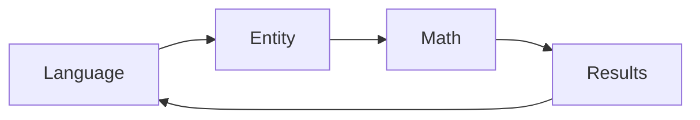

---
[[wearscape-ai]]

# Chatgpt Chef
- [ ] Dimitar had an interesting idea of a chatbot that can help with cooking - like a Chef plugin. You can chat with it interactively where you can say "Tell me how to make lasgna with a mexican twist". It can pick a spice or two from mexico that pairs well with the ingredients of lasagna and suggest that as a recipe. Would be very interesting to build as a Plugin.
	- Question is do we have a dataset or more of recipes from the world to build this on?
		- [Food.com Recipes and Interactions | Kaggle](https://www.kaggle.com/datasets/shuyangli94/food-com-recipes-and-user-interactions?resource=download)
	- How should this be architected
	- [[2023-04-04-Tuesday]] - Perhaps this is not the best idea since ChatGPT is already trained on internet scale data so adding this in is not adding any novelty to its capability. The core of Plugins would be to either look up new / updated information or perform an action that the language model is incapable of. In the recipes case there is neither usecase. The model cant query a fusion recipe for how good it is or look up the latest & greatest recipe since those dont change much either. In retrospect - ya a plugin is possible but is it really needed?

# Code Generation

Similar technologies being developed:

- TransCoder: Unsupervised Translation of Programming Languages[(Paper Explained)- Yanik's channel](https://www.youtube.com/watch?v=xTzFJIknh7E)
  - Facebook's paper that generated Python code
- [Aroma](https://arxiv.org/pdf/1812.01158.pdf): indexes a huge code corpus including thousands of open-source projects, takes a partial code snippet as input, searches the corpus for method bodies containing the partial code snippet, and clusters and intersects the results of the search to recommend a small set of succinct code snippets which both contain the query snippet and appear as part of several methods in the corpus. (Facebook).
- [Intel's MISIM](https://arxiv.org/pdf/2006.05265.pdf): 40x better than Aroma apparently. Its very similar idea except maybe MISIM is using a latent space (generated through an encoder) to match code samples. This might make it language agnostic so could also be used to translate one to the other.
  - MIT Tech review article - [A new neural network could help computers code themselves](https://www.technologyreview.com/2020/07/29/1005768/neural-network-similarities-between-programs-help-computers-code-themselves-ai-intel/?truid=aa6ca2814d337aa87afac67cde970883&utm_source=the_algorithm&utm_medium=email&utm_campaign=the_algorithm.unpaid.engagement&utm_content=07-31-2020)
  - TabNine and Kite are two services offering NMT based CodeGeneration / IDE completion.
  - [OpenAI generated Python code](https://www.youtube.com/watch?v=utuz7wBGjKM)

# Media Authentication for Deep Fakes

Could images captured by camera driver (or whatever capture system, app etc) be tagged with a [[SHA256]] like hash/tag/ID to verify that it has not been doctored.

So users would get an image/video or any media as well as an associated tag that verifies that this piece of media is not doctored/[[deep fake]]. If they get a new video could run it through a [[hash]] check to verify. The hash is provided by the person or organization shipping the media. Its a simple verification code.

Might be interesting to look at [[git]] [internals](https://git-scm.com/book/en/v2/Git-Internals-Git-Objects) and see if that hashing scheme could be applied to images for example.

# Chain of Thought Prompting

[[2023-06-19-Monday]] - I think plugins and langchain pretty much solve this problem.

Why not use well known math techniques when the [[large language model]] needs to do math. Hook up a math engine with an entity selector.
[[*shiny-fm-datasets]] - Socratic model like: use one for generative data other one for entity selection. Then take entities and run math on them.

