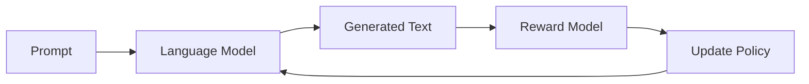

# Reinforcement Learning for Language Models Tutorial

This tutorial provides a detailed implementation of applying Reinforcement Learning (RL) to fine-tune Language Models (LMs). We'll use the Proximal Policy Optimization (PPO) algorithm to train a language model to generate better responses based on human feedback.

## Conceptual Overview

### 1. What is RL for Language Models?

Reinforcement Learning for Language Models involves:
1. Taking actions (generating text) in response to states (prompts)
2. Receiving rewards based on the quality of generated text
3. Updating the model to maximize expected rewards



### 2. Key Components

#### a. Policy Network (Language Model)
- Takes prompts as input
- Generates text responses
- Implemented using Smol-Instruct model

```python
class RLModel(nn.Module):
    def __init__(self, model_name: str):
        self.model = AutoModelForCausalLM.from_pretrained(model_name)
        self.value_head = ValueHead(self.model.config.hidden_size)
        
    def forward(self, input_ids, attention_mask=None):
        outputs = self.model(
            input_ids=input_ids,
            attention_mask=attention_mask,
            output_hidden_states=True
        )
        values = self.value_head(outputs.hidden_states[-1])
        return {"logits": outputs.logits, "values": values}
```

#### b. Value Network
- Estimates expected returns for states
- Helps in computing advantages for policy updates

```python
class ValueHead(nn.Module):
    def __init__(self, hidden_size: int):
        self.value_head = nn.Sequential(
            nn.Linear(hidden_size, hidden_size),
            nn.Tanh(),
            nn.Linear(hidden_size, 1)
        )
    
    def forward(self, hidden_states):
        return self.value_head(hidden_states)
```

#### c. Experience Buffer
- Stores trajectories (state, action, reward, etc.)
- Computes advantages using GAE

```python
@dataclass
class Experience:
    state_ids: torch.Tensor
    action_ids: torch.Tensor
    attention_mask: torch.Tensor
    rewards: torch.Tensor
    values: torch.Tensor
    log_probs: torch.Tensor
    advantages: torch.Tensor = None
    returns: torch.Tensor = None

class ExperienceBuffer:
    def compute_advantages(self, gamma: float, lambda_: float):
        for exp in self.experiences:
            # GAE computation
            advantages = torch.zeros_like(exp.rewards)
            last_gae = 0
            for t in reversed(range(len(exp.rewards))):
                delta = exp.rewards[t] + gamma * next_value - exp.values[t]
                advantages[t] = delta + gamma * lambda_ * last_gae
                last_gae = advantages[t]
```

### 3. Training Process Step by Step

#### Step 1: Generate Responses
```python
# Get a batch of prompts
state_ids, attention_mask = data_handler.get_batch(batch_size)

# Generate responses using current policy
action_ids, values, logits = agent.get_action(
    state_ids,
    attention_mask,
    temperature=1.0
)
```

#### Step 2: Compute Rewards
```python
def compute_reward(self, prompt: str, response: str, chosen: str, rejected: str):
    # Tokenize texts
    response_tokens = set(self.tokenizer.tokenize(response))
    chosen_tokens = set(self.tokenizer.tokenize(chosen))
    rejected_tokens = set(self.tokenizer.tokenize(rejected))
    
    # Compute overlap-based reward
    chosen_overlap = len(response_tokens.intersection(chosen_tokens))
    rejected_overlap = len(response_tokens.intersection(rejected_tokens))
    reward = (chosen_overlap - rejected_overlap) / max(len(response_tokens), 1)
    return reward
```

#### Step 3: PPO Update
```python
def train_step(self, experience: Experience, old_logits: torch.Tensor):
    # Get new predictions
    outputs = self.model(experience.state_ids, experience.attention_mask)
    new_logits = outputs["logits"]
    new_values = outputs["values"]
    
    # Compute probability ratios
    ratio = torch.exp(new_log_probs - old_log_probs)
    
    # Compute PPO loss
    policy_loss_unclipped = ratio * advantages
    policy_loss_clipped = torch.clamp(ratio, 1-eps_clip, 1+eps_clip) * advantages
    policy_loss = -torch.min(policy_loss_unclipped, policy_loss_clipped).mean()
    
    # Compute value loss
    value_loss = F.mse_loss(new_values, experience.returns)
    
    # Update model
    total_loss = policy_loss + value_loss_coef * value_loss
    total_loss.backward()
```

### 4. Mental Model Building Blocks

Let's break down the key concepts that you need to understand:

#### a. The Policy (Language Model)
Think of the language model as a policy that maps states (prompts) to actions (responses):
```
Prompt → LM → Response
```

Key insight: We're not changing how the LM works, we're just adjusting its weights to make it generate better responses.

#### b. Value Estimation
The value head tries to predict the expected reward:
```
Value Head: "If I start from this prompt, what reward do I expect to get?"
```

This helps us determine if an action was better or worse than expected.

#### c. Advantage Computation
Advantage tells us "how much better was this action than expected?":
```
Advantage = Actual Reward - Predicted Value
```

If positive: Action was better than expected
If negative: Action was worse than expected

#### d. PPO Updates
PPO uses a simple principle: "Don't change the policy too much at once"
```
1. Calculate how different the new policy is from the old one (ratio)
2. Clip this difference to prevent large changes
3. Take the minimum of clipped and unclipped objectives
```

This ensures stable learning.

### 5. Learning Process Visualization

```
Episode Loop:
    1. Get prompt
    2. Generate response
    3. Get reward
    4. Store experience
    
    If buffer full:
        1. Compute advantages
        2. For each batch:
            a. Get policy predictions
            b. Compare with old policy
            c. Update if improvement is reasonable
            d. Stop if policy changes too much
```

### 6. Common Pitfalls and Solutions

1. **Reward Sparsity**
   - Problem: Most responses get low rewards
   - Solution: Reward shaping, curriculum learning

2. **Policy Collapse**
   - Problem: Model generates same safe responses
   - Solution: KL penalties, entropy bonuses

3. **Value Estimation**
   - Problem: Poor value predictions
   - Solution: Separate value training, proper scaling

### 7. Debugging Tips

1. **Monitor KL Divergence**
   ```python
   kl = compute_kl_divergence(old_logits, new_logits)
   if kl > target_kl:
       break  # Stop training for this batch
   ```

2. **Check Advantage Scale**
   ```python
   advantages = (advantages - advantages.mean()) / (advantages.std() + 1e-8)
   ```

3. **Validate Rewards**
   ```python
   print(f"Reward stats: min={rewards.min()}, max={rewards.max()}, "
         f"mean={rewards.mean()}, std={rewards.std()}")
   ```

## Running Experiments

1. Start with a small learning rate (2e-5)
2. Monitor KL divergence closely
3. Check reward distribution
4. Validate generated responses
5. Use wandb for tracking

## Next Steps

1. **Experiment with Reward Functions**
   - Try different similarity metrics
   - Implement learned reward models
   - Combine multiple objectives

2. **Architectural Variations**
   - Different value head designs
   - Shared vs separate networks
   - Different base models

3. **Advanced Techniques**
   - Curriculum learning
   - Multi-task RL
   - Hierarchical RL

## References

1. PPO Paper: [Proximal Policy Optimization Algorithms](https://arxiv.org/abs/1707.06347)
2. RLHF Paper: [Learning to Summarize from Human Feedback](https://arxiv.org/abs/2009.01325)
3. InstructGPT: [Training Language Models to Follow Instructions](https://arxiv.org/abs/2203.02155)